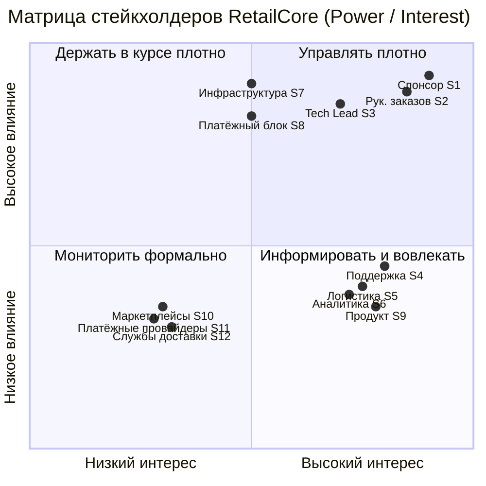
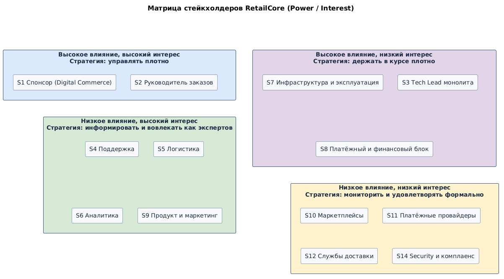

# Карта стейкхолдеров — RetailCore

Задание 1, артефакт stakeholders.md. Документ фиксирует, с кем нужно разговаривать для уточнения требований, что каждый стейкхолдер знает и контролирует, какие у него интересы и риски, и в каком порядке с ним взаимодействовать.

## 1. Как читать карту

Тип знания показывает, какой пласт информации держит роль, а именно бизнес-цели, фактическое поведение процесса, техническое устройство, данные или эксплуатацию. Влияние отражает, насколько роль воздействует на архитектурные решения и на успех трансформации, и оценивается как высокое, среднее или низкое. Интерес отражает вовлечённость и заинтересованность роли в результате. Приоритет интервью задаёт порядок сбора информации так, чтобы гипотезы одних ролей можно было проверять у других. Классификация по влиянию и интересу построена по сетке Менделоу.

## 2. Сводная матрица Power/Interest

Ниже — быстрый вид в Mermaid. Тот же квадрант в PlantUML лежит в файле [diagrams/stakeholders-matrix.puml](diagrams/stakeholders-matrix.puml), а его отрендеренная картинка — в diagrams/stakeholders-matrix.png.

Отрендеренная версия матрицы из PlantUML приведена ниже.

## 3. Реестр стейкхолдеров

### 3.1. Ключевые роли, с которыми интервью обязательны по заданию

| Код | Роль | Кто из материалов | Тип знания | Влияние | Интерес | Что контролирует и решает | Главный интерес | Основной риск для проекта |
|---|------|---------------------|-----------|---------|---------|---------------------------|-----------------|---------------------------|
| S1 | Спонсор проекта и бизнес-заказчик | Дмитрий, Director of Digital Commerce | Бизнес-цели, приоритеты, ограничения и бюджет | Высокое | Высокий | Приоритеты трансформации, финансирование по этапам и критерии успеха | Скорость и предсказуемость изменений при сохранении устойчивости order flow | Теряет доверие при отсутствии промежуточной бизнес-ценности и может свернуть бюджет |
| S2 | Руководитель команды заказов и оформления | Интервью запланировано, стенограммы пока нет | Фактическое устройство ключевого процесса, исключения и ручные операции | Высокое | Высокий | Процесс оформления и пост-обработки, приоритеты доработок ядра заказа | Работоспособность checkout и снижение операционного шума | Держит молчаливое знание процесса и может сопротивляться изменению устоявшихся обходов |
| S3 | Технический лидер монолитного ядра | Андрей, Tech Lead Java-монолита | Фактическое техническое устройство, связность, техдолг и узкие места | Высокое | Высокий | Кодовая база монолита, порядок выноса функций и техническая допустимость изменений | Управляемость связности и отсутствие регрессий в checkout | Может недооценить скрытые зависимости, в том числе в Oracle-пакетах, и распылить усилия |

### 3.2. Роли, по которым уже есть стенограммы и которые использованы для анализа

| Код | Роль | Кто | Тип знания | Влияние | Интерес | Что контролирует и решает | Главный интерес | Основной риск для проекта |
|---|------|-----|-----------|---------|---------|---------------------------|-----------------|---------------------------|
| S4 | Руководитель клиентской поддержки | Ольга, Head of Customer Support | Клиентские боли, непрозрачность статусов и ручные сценарии восстановления | Среднее | Высокий | Процессы поддержки, эскалации и требования к наблюдаемости заказа | Прозрачность и объяснимость состояния заказа для оператора и клиента | Теряет производительность, если на переходе пропадёт наблюдаемость, что бьёт по SLA |
| S5 | Разработчик логистических и партнёрских интеграций | Ирина, Senior Developer интеграций | Устройство интеграционного контура, обмен через БД и идемпотентность | Среднее | Высокий | Способ реализации интеграций и конфиги маршрутизации | Унификация интеграций и снижение ручных настроек и дублей | Может недооценить исключения, такие как крупногабарит, split shipment и ручная переадресация |
| S6 | Разработчик аналитики и отчётности | Максим, Senior Python Developer аналитики | Модель данных, витрины, lineage и нагрузка на Oracle | Среднее | Высокий | Аналитические пайплайны, витрины и окна выгрузок | Каноническая модель событий заказа и снятие нагрузки с операционной Oracle | Сталкивается с расхождением цифр между функциями бизнеса и конкуренцией за Oracle |

### 3.3. Роли, которые предстоит вовлечь дополнительно и которые выявлены из контекста

| Код | Роль | Тип знания | Влияние | Интерес | Зачем нужен | Статус |
|---|------|-----------|---------|---------|-------------|--------|
| S7 | Команда инфраструктуры и эксплуатации on-premise | Ограничения ЦОД, виртуализация, ёмкость серверов, эксплуатация Oracle и план ухода от неё | Высокое | Средний | Подтвердить инфраструктурные лимиты, RTO и RPO, план импортозамещения | Интервью не проведено, это пробел |
| S8 | Владелец платёжных интеграций и финансовый блок | Платёжные сценарии, возвраты и консистентность денег и статусов | Высокое | Средний | Уточнить требования к консистентности денег и статуса и SLA платежей | Интервью не проведено, это пробел |
| S9 | Продукт и маркетинг, отвечающие за промо, кампании и персонализацию | Требования к промо-механикам и будущим сценариям персонализации и партнёрств | Среднее | Высокий | Уточнить требования к будущей гибкости промо и работе с каналами | Интервью не проведено, это пробел |
| S10 | Внешние партнёры-маркетплейсы | Контракты интеграции, форматы статусов и задержки подтверждений | Среднее | Низкий | Уточнить SLA внешних подтверждений и семантику статусов | Косвенно через S4 и S5 |
| S11 | Внешние платёжные провайдеры | API платежей, идемпотентность и тайминги callback | Среднее | Низкий | Уточнить SLA и режимы отказа платёжного шлюза | Косвенно через S8 |
| S12 | Внешние службы доставки | API и форматы, подтверждение слотов и режимы деградации | Среднее | Низкий | Уточнить SLA подтверждения слота и поведение при недоступности | Косвенно через S5 |
| S13 | Операционный блок, распределяющий поток между партнёрами | Ручные правила перераспределения потока | Среднее | Средний | Формализовать ночные ручные настройки маршрутизации | Интервью не проведено, это пробел |
| S14 | Security, комплаенс и импортонезависимость | Требования к отказу от зарубежных компонентов, включая Oracle | Среднее | Средний | Уточнить жёсткость и сроки импортозамещения | Интервью не проведено, это пробел |

## 4. Стратегия вовлечения

Стейкхолдеры с высоким влиянием, а именно S1, S2, S3, S7 и S8, требуют плотного управления, поэтому с ними нужны регулярные согласования, участие в приоритизации и валидация целевого состояния и плана. Роли с высоким интересом и экспертным знанием, а именно S4, S5, S6, S9 и S13, работают как эксперты, поэтому с ними проводятся глубинные интервью, проверка гипотез и ревью артефактов AS-IS и TO-BE. Внешних партнёров S10, S11, S12 и роль S14 достаточно мониторить и удовлетворять формально, уточняя SLA и контракты по мере необходимости.

## 5. Приоритет интервью

- [x] S1, спонсор. Задаёт рамку целей, ограничений и критериев успеха. Стенограмма есть.
- [ ] S2, руководитель заказов. Раскрывает фактический ключевой процесс и исключения. Нужно провести, сценарий подготовлен.
- [x] S3, Tech Lead монолита. Раскрывает техническую реальность и связность. Стенограмма есть, сценарий уточняющего интервью подготовлен.
- [x] S4, S5 и S6, поддержка, логистика и аналитика. Проверяют гипотезы на отклонениях от happy path и на данных. Стенограммы есть.
- [ ] S7, S8, S13 и S14. Закрывают архитектурно значимые пробелы по инфраструктуре, платежам, ручной маршрутизации и импортозамещению. Интервью планируются.

Принцип последовательности такой: гипотезы, полученные сверху от бизнеса, проверяются снизу у разработчиков и поддержки, а расхождения фиксируются как противоречия для эскалации, что подробно разобрано в файле interview-analysis.md.

## 6. Ключевые пробелы по стейкхолдерам

Нет прямого интервью с инфраструктурой и эксплуатацией S7, поэтому не подтверждены ёмкость, RTO и RPO, а также реальный план ухода от Oracle. Нет владельца платёжного контура S8, поэтому не подтверждены требования к консистентности денег и статуса. Ручные правила маршрутизации S13 держатся на людях и не формализованы, поэтому нужен владелец процесса. Требования импортонезависимости S14 заявлены бизнесом как важные, но не ценой остановки процессов, при этом конкретные сроки и границы отсутствуют.
