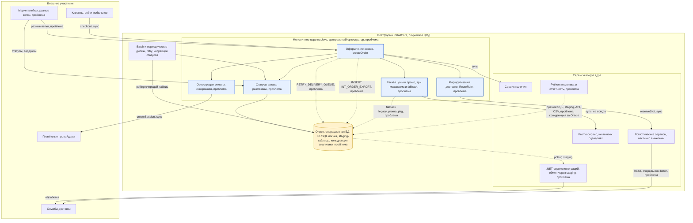
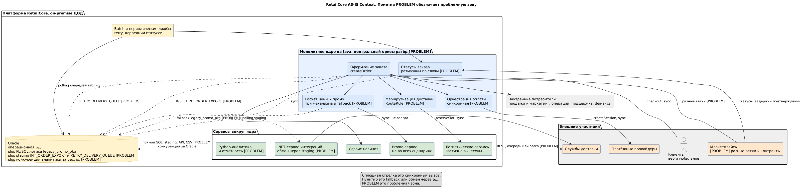

# AS-IS, анализ текущего состояния — RetailCore

Задание 2, артефакт as-is-analysis.md. Документ отвечает на вопрос, как система реально устроена сейчас и где основные ограничения для изменений. Он сопровождается диаграммой контекста AS-IS, которая приведена ниже в Mermaid для быстрого чтения, а её исходник в PlantUML лежит в файле diagrams/as-is-context.puml, из которого генерируется картинка diagrams/as-is-context.png.

Достоверность обозначается словами. Значение «Подтверждено» означает прямое подтверждение, значение «Гипотеза» означает косвенный вывод, а значение «Пробел» означает отсутствие значения.

## 1. Краткое резюме

RetailCore — это монолитное ядро на Java с централизованной Oracle, вокруг которого органически наросли сервисы на Python и .NET и разнородные интеграции. Монолит остаётся центральным оркестратором почти всех заказов. Ключевые ограничения для изменений сводятся к нескольким пунктам.

Связность высокая, поэтому вынос любой функции тянет скрытые зависимости, а именно справочники, batch, админ-сценарии, старые API и PL/SQL. Логика размазана, поскольку цена, промо, маршруты и статусы живут одновременно в коде, Oracle-пакетах, конфигах и админ-таблицах. Checkout синхронный и хрупкий, поскольку платежи, наличие и логистика вызываются синхронно в длинной транзакции оформления. Интеграционный контур неоднороден, поскольку используются REST, очереди, обмен через staging-таблицы и batch с разной семантикой доставки. Зависимость от Oracle касается не только данных, но и бизнес-логики, при этом аналитика конкурирует за ту же БД. Наблюдаемость слабая, поскольку сквозного correlation-id нет, а статус заказа расходится между витринами.

## 2. Диаграмма контекста AS-IS

Диаграмма показывает основные части системы, внешних участников, ключевые интеграции и стили взаимодействия, а также проблемные зоны и зависимости. В подписях узлов и связей пометка «проблема» обозначает проблемную зону, сплошная стрелка обозначает синхронный вызов, а пунктир обозначает fallback или обмен через БД.

Отрендеренная версия той же диаграммы из PlantUML приведена ниже.

## 3. Основные части системы и их роль

| Часть | Технология | Роль | Проблема |
|-------|-----------|------|----------|
| Монолитное ядро | Java | Оркестрирует заказ, а именно оформление, цену и промо, маршрутизацию, статусы и оплату | Является центральной точкой связности, а логика размазана |
| Promo-сервис | Внешний сервис | Считает скидки | Используется не во всех сценариях, а при отказе включается урезанный fallback в Oracle |
| Сервис наличия | Сервис | Проверяет и резервирует товар | Вызывается синхронно в checkout и тормозит оформление |
| Логистические сервисы | Смешанно | Резервируют слот и маршрутизируют | Считаются вынесенными, но зависят от Oracle и служебных полей монолита |
| .NET-сервис | .NET | Интегрирует часть партнёров | Обменивается через staging-таблицы по polling, поэтому хрупок |
| Python-аналитика | Python | Строит отчётность и витрины | Обращается напрямую к операционной Oracle и конкурирует за ресурс |
| Oracle | Oracle | Хранит операционные данные, PL/SQL-логику и staging | Является барьером производительности и развития, а часть логики лежит в пакетах |
| Batch-джобы | Планировщик | Выполняют retry доставки, коррекции статусов и актуализацию маршрутов | Выполняют часть переходов статусов, поэтому содержат скрытую логику |

## 4. Ключевые потоки данных

Оформление заказа является синхронным и критичным потоком. Клиент вызывает createOrder, после чего идут расчёт цены и промо через promo-сервис или fallback на PL/SQL, проверка наличия, выбор маршрута, вызов reserveSlot к логистике, создание платёжной сессии и перевод в статус CONFIRMED. Всё это выполняется в одной длинной транзакции, а каждый внешний вызов является точкой отказа. Ветвление по каналу MARKETPLACE и региону FAR_EAST задано прямо в коде. Подтверждено.

Отложенная доставка является потоком деградации. При отказе reserveSlot заказ переходит в статус DELIVERY_PENDING, а запись попадает в таблицу RETRY_DELIVERY_QUEUE, которую дообрабатывает batch. Подтверждено.

Обмен с .NET идёт через БД. Ядро выполняет INSERT в INT_ORDER_EXPORT, после чего .NET читает staging и обрабатывает или передаёт данные партнёру. Подтверждено.

Ручной ревью запускается через RouteRule.requiresManualReview, что переводит заказ в статус WAITING_MANUAL_REVIEW и отправляет его на ручной разбор оператором. Подтверждено.

Аналитика забирает данные несколькими разнородными пайплайнами, а именно прямым SQL, staging, API сервисов и CSV, и строит витрины в режимах real-time, почасовом и ночном. Канонической модели нет, а цифры расходятся. Подтверждено.

Статусы меняются в сервисе заказов, платёжном модуле, batch-процедурах и вручную операторами, поэтому единой точки нет. Подтверждено.

## 5. Зависимости и почему они ограничивают изменения

| Зависимость | Природа | Ограничение для трансформации |
|-------------|---------|-------------------------------|
| Монолит зависит от Oracle по данным и логике | Прямой SQL и PL/SQL-пакеты | Нельзя вынести сервис, не вынеся часть логики из БД, что фиксирует CON-05 |
| Ядро оркестрирует вынесенные сервисы | Оркестрация идёт из монолита | Сервисы не автономны, поэтому нужна новая точка оркестрации, что показывает O-01 |
| Обмен идёт через staging-таблицы | .NET и batch читают и пишут БД | Изменение схемы или поведения даёт скрытые побочные эффекты, что фиксирует CON-07 |
| Каналы порождают ветки поведения | Условия по channel и region в коде и правила в БД | Одинаковый заказ фактически разный, поэтому легко пропустить ветку, что фиксирует CON-11 |
| Аналитика зависит от операционной Oracle | Прямой доступ | Разгрузка требует канонического слоя событий, что показывает O-18 |
| Логистика зависит от служебных полей монолита | Признаки и статусы формирует ядро | Часть интеграций не работает без полей монолита, что показывает O-01 |
| Ручные правила и операции | Конфиги, админ-таблицы и ночные SQL | Поведение не воспроизводимо без людей, что показывают O-05 и O-20 |

Главным ограничителем является связность в сочетании с размазанностью логики и зависимостью от Oracle. Поэтому любой вынос нужно предварять созданием швов, наблюдаемости и канонической модели.

## 6. Анализ по проблемным зонам

Зона PZ-1 про оформление, цену и промо содержит минимум три механизма расчёта, а именно старый в монолите, механизм под маркетплейсы и механизм под регионы, а также исключения в коде, Oracle и конфиге. Fallback на legacy_promo_pkg даёт урезанный результат, и бизнес терпит это ради прохождения checkout. Риск состоит в непредсказуемости промо и скрытой деградации, а ограничение в том, что цену и промо нельзя просто вынести, поскольку часть логики лежит в PL/SQL.

Зона PZ-2 про статусы содержит формальный жизненный цикл от new до delivered или cancelled, а также множество отклонений и спец-статусов под конкретные маркетплейсы и партнёра. Переходы выполняются в разных местах и вручную, а витрины статуса расходятся между личным кабинетом, письмом, оператором и складом. Риск состоит в непрозрачности и ручном разборе.

Зона PZ-3 про интеграционный контур не имеет единого слоя, поскольку один партнёр получает синхронный REST, другой batch-выгрузку, третий сообщения через брокер, а четвёртый работает через .NET. Семантика различается между at-least-once и polling, а идемпотентность решается по-разному. Риск состоит в дублях заявок, рассинхроне и ручном разборе.

Зона PZ-4 про Oracle содержит логику в пакетах и таблицах, обмен через staging, десятки терабайт, частичное архивирование и конкуренцию аналитики, а также длинные транзакции. Риск состоит в том, что БД является барьером и производительности, и развития, а любая правка схемы стоит дорого.

Зона PZ-5 про каналы разводит сайт, мобильное приложение и маркетплейс по разным веткам. Риск состоит в том, что изменение для всех каналов ломает частные ветки, и в том, что ветки недооцениваются на схемах.

Зона PZ-6 про наблюдаемость не имеет сквозного correlation-id через монолит, .NET и Python, а карточка заказа не является единым источником правды, поэтому поддержка достраивает прозрачность вручную. Риск состоит в росте нагрузки и SLA и в потере прозрачности на переходе.

Зона PZ-7 про данные и аналитику не имеет канонической модели заказа и событий, поэтому один объект трактуется по-разному, а lineage слабый. Риск состоит в плохой управляемости и спорах о данных.

Зона PZ-8 про синхронные внешние вызовы в checkout выполняет наличие, логистику и платежи синхронно в транзакции оформления, поэтому на пиках наступает деградация, а изменение расчёта цены неожиданно роняет время ответа. Риск состоит в хрупкости выручки на сезонных пиках.

## 7. Что видно непосредственно из кода OrderProcessingService.java

Фрагмент кода является концентратом проблем, поскольку класс намеренно смешивает ответственности.

| Место в коде | Что происходит | Симптом проблемы |
|--------|----------------|------------------|
| Восемь зависимостей в конструкторе | Внедряются Repo, Promo, Payment, Delivery, RouteRule, Status, LegacySqlExecutor и DataSource | God-класс со смешением ответственности |
| Ветвление по MARKETPLACE и FAR_EAST | Надбавки заданы прямо в коде | Каналы и регионы захардкожены, что относится к PZ-5 |
| promoService с fallback на legacy_promo_pkg | Промо считается двойной логикой | Неэквивалентный fallback, что относится к PZ-1 |
| INSERT в INT_ORDER_EXPORT | Прямой SQL в staging | Обмен через БД с .NET, что относится к PZ-3 и PZ-4 |
| findRule и requiresManualReview | Маршрутизация и ручной ревью в ядре | Логистика в монолите, что относится к PZ-2 и PZ-5 |
| reserveSlot синхронно | Синхронный вызов логистики в оформлении | Хрупкий checkout, что относится к PZ-8 |
| INSERT в RETRY_DELIVERY_QUEUE | Отложенная доставка через таблицу-очередь | Деградация через БД, что относится к PZ-3 |
| createSession синхронно с исключением | Синхронная оплата и исключение при отказе | Хрупкость платежа в транзакции, что относится к PZ-8 |
| setStatus в разных местах и прямой UPDATE ORDERS | Статусы меняются из ядра и напрямую SQL | Размазанные статусы, что относится к PZ-2 |

Итог по коду в том, что один метод createOrder содержит бизнес-правила, расчёт промо, маршрутизацию, работу со статусами, прямой SQL к Oracle и синхронные внешние вызовы, что визуально подтверждает все ключевые проблемные зоны.

## 8. Анализ артефактов, на основании которых восстановлено состояние

| Артефакт | Что дал | Ограничения и достоверность |
|----------|---------|------------------------------|
| interview-1-tech-lead.md, S3 | Связность, размазанную логику, Oracle-пакеты, синхронный checkout, слабую наблюдаемость и безопасные швы | Является экспертным мнением одного лица, а часть сведений это устное знание команды, не задокументированное |
| interview-2-logistics.md, S5 | Отсутствие единого интеграционного контура, обмен через БД, идемпотентность, ручную маршрутизацию и критичность Oracle для вынесенной логистики | Является взглядом из интеграционного контура, а количественных метрик нет |
| interview-3-analytics.md, S6 | Отсутствие канонической модели, расхождение цифр, конкуренцию за Oracle и слабый lineage | Отражает проблемы ядра через данные и не покрывает операционные детали |
| interview-support.md, S4 | Непрозрачность статусов, карточку не как единый источник правды, ручные сценарии и боль отклонений от happy path | Является взглядом поддержки, а технические причины видны косвенно |
| interview-business.md, S1 | Бизнес-цели, приоритеты, ограничения, границы риска и критерии успеха | Является стратегическим уровнем без технических деталей и чисел |
| OrderProcessingService.java | Фактический стиль кода, а именно God-класс, прямой SQL, синхронные вызовы, ветвление каналов, fallback и staging | Является намеренно иллюстративным фрагментом, а не всей кодовой базой |
| PlantUML-диаграмма, упомянутая в кейсе | Одно из представлений AS-IS | Является неполной, поэтому используется как источник, а не как эталон, и расходится с фактическим поведением, что зафиксировано в противоречии C-6 |

Метод восстановления состоял в триангуляции, то есть каждое утверждение подтверждалось минимум из двух независимых источников, а именно интервью и кода или интервью разных ролей. Расхождения зафиксированы как противоречия в файле ../Task1/interview-analysis.md в разделе 2.

## 9. Ограничения анализа и пробелы

Нет прямого интервью с инфраструктурой S7 и платёжным блоком S8, поэтому не подтверждены RTO и RPO, SLA и модель консистентности денег и статуса. Все количественные NFR отсутствуют, а именно p95 и p99, RPS и TPS и объёмы роста, что подробно раскрыто в файле ../Task1/requirements.md в разделе 7. Код является только фрагментом, поэтому полная карта связности требует статического анализа кодовой базы и схемы Oracle. PlantUML-диаграмма не приложена к материалам в актуальном виде, поэтому восстановление опиралось на интервью и код.

Эти ограничения переносятся в задание 3 как условия вида не трогать до уточнения и в задание 4 как пункты, требующие baseline-измерений перед стартом этапов.
