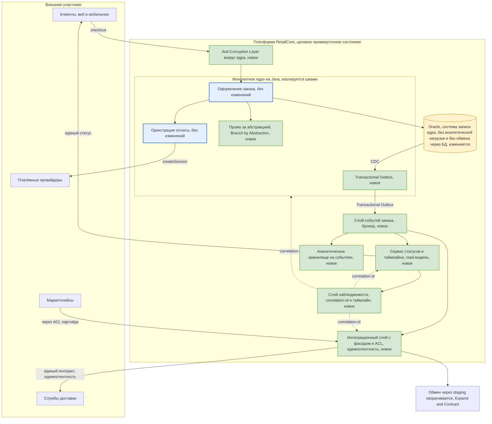
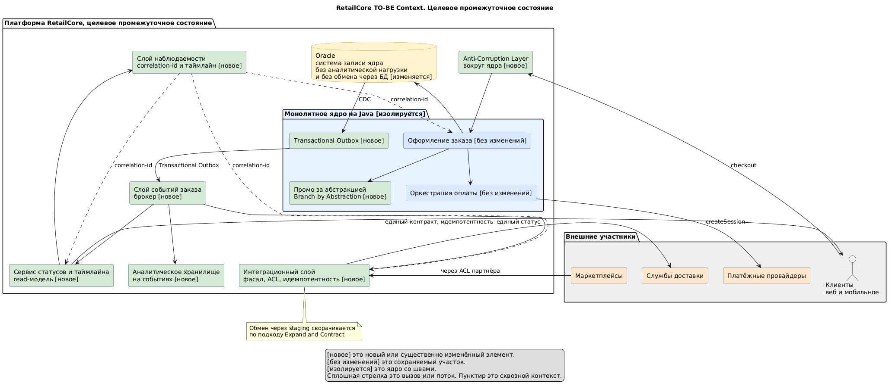

# Точки трансформации и целевая архитектура — RetailCore

Задание 3, артефакт transformation.md. Документ описывает точки трансформации и реалистичное промежуточное целевое состояние платформы на горизонте трансформации, а не идеальную схему полной переписи. Он опирается на подтверждённые требования и проблемные зоны из заданий 1 и 2 и на согласованный принцип не трогать критичное ядро первым.

Достоверность обозначается словами. Значение «Подтверждено» означает прямое подтверждение в кейсе или интервью. Значение «Гипотеза» означает косвенный вывод. Значение «Пробел» означает отсутствие значения во входных данных.

## 1. Принципы и рамка трансформации

Трансформация подчинена нескольким принципам, согласованным с бизнесом в интервью S1. Каждый шаг инкрементален и даёт промежуточную бизнес-ценность. Сначала создаются швы и наблюдаемость, а вынос идёт потом. Критичное ядро, а именно оформление заказа и оркестрация оплаты, не переписывается первым, а изолируется. Каналы рассматриваются как вариации общей модели, а не как независимые ветки. Обеспечивается единый источник правды по статусу и каноническая модель событий. Скрытые fallback заменяются явными политиками деградации. Отказ от Oracle идёт фоном и не ценой остановки процессов.

Количественные цели, а именно SLA и SLO, RTO и RPO, p95 и p99, RPS и допустимые задержки, во входных данных отсутствуют, поэтому в этом документе они остаются пробелами и указаны там, где их нужно закрыть до фиксации целевых значений. Полный реестр пробелов лежит в файле ../Task1/requirements.md в разделе 7.

## 2. Каталог паттернов модернизации

Паттерны введены явно, чтобы разработчикам была понятна задумка и чтобы каждый шаг опирался на проверенный приём, а не на импровизацию.

| Паттерн | Зачем в этом кейсе | Где применяется |
|---------|--------------------|-----------------|
| Strangler Fig | Является зонтичным приёмом, поскольку новый контур постепенно перехватывает функции старого, а монолит отмирает по частям без большого взрыва | Вся программа, каждая точка трансформации |
| Anti-Corruption Layer | Изолирует новую модель от легаси и от внешних партнёров, поэтому грязная модель монолита и разнородные контракты партнёров не протекают внутрь | Границы ядра, интеграционный слой, внешние партнёры |
| Branch by Abstraction | Позволяет вынести логику постепенно за абстракцией без остановки checkout, поскольку старая и новая реализации живут за одним интерфейсом и переключаются флагом | Вынос промо и части расчёта |
| Event Interception | Перехватывает изменения заказа и превращает их в события, поэтому потребители переходят на события, не трогая источник сразу | Канонический слой событий заказа |
| Transactional Outbox и CDC | Гарантируют, что событие публикуется согласованно с изменением в БД, поэтому исчезает обмен через staging-таблицы по polling | Публикация событий из монолита и Oracle |
| Expand and Contract, он же parallel change | Меняет схему и контракты в три шага, а именно расширение, миграция потребителей и сжатие, поэтому уход от staging-таблиц и от Oracle-связности идёт без простоя | Работа с БД и контрактами интеграций |
| Parallel Run и Shadow | Гоняет новый контур параллельно старому и сверяет результаты, поэтому переключение происходит только после доказанной эквивалентности | Проверка read-модели статусов и cutover в задании 4 |
| CQRS, read model | Отделяет чтение от записи, поэтому единый источник правды по статусу строится как отдельная read-модель, не трогая транзакцию записи | Сервис статусов и таймлайна заказа |
| Idempotency key и Inbox | Обеспечивают безопасную повторную обработку, поэтому исчезают дубли заявок у партнёров | Интеграционный слой |

## 3. Точки трансформации

Каждая точка трансформации описана по единому шаблону, а именно какая проблема решается, почему участок подходит для изменений, какие зависимости и риски нужно учитывать, какой паттерн применяется и какой ожидается эффект.

### TP-1. Сквозная наблюдаемость и correlation-id

Решается проблема из зоны PZ-6, поскольку сквозного идентификатора нет, а восстановление истории заказа через монолит, .NET и Python ручное. Участок подходит для изменений, поскольку добавление correlation-id и структурных логов не меняет бизнес-логику и потому безопасно. Зависимости состоят в том, что точки входа монолита и интеграций должны прокидывать идентификатор дальше. Риски низкие и сводятся к неполному покрытию старых веток. Применяется приём сквозного контекста и трассировки. Ожидаемый эффект в том, что появляется опора для всех последующих шагов и для наблюдаемости на переходе, что требует NFR-09 и NFR-11. Является enabling-шагом, поэтому идёт первым.

### TP-2. Канонический слой событий заказа

Решается проблема из зон PZ-2 и PZ-7, поскольку канонической модели заказа и событий нет, а статусы и цифры расходятся между витринами. Участок подходит для изменений, поскольку события можно начать публиковать, не переписывая источник, через перехват изменений. Зависимости состоят в наличии брокера, что относится к допущению ASM-03 и требует уточнения у S7, и в согласии на единый словарь событий. Риски состоят в неполноте событийной модели и в двойной записи, что снимается паттерном Transactional Outbox. Применяются Event Interception, Transactional Outbox и CDC. Ожидаемый эффект в том, что появляется единый поток бизнес-событий заказа и доставки, на который затем переводятся аналитика, статусы и наблюдаемость, что требует NFR-07. Пробелом остаётся допустимая задержка события, что закрывает GAP-04 у S4 и S6.

### TP-3. Сервис статусов и таймлайна заказа как read-модель

Решается проблема из зон PZ-2 и PZ-6, поскольку карточка заказа не является единым источником правды, а переходы статусов размазаны. Участок подходит для изменений, поскольку чтение статусов слабо связано с транзакцией оформления, что подтверждает S3, и его можно вынести как read-модель. Зависимости состоят в готовом слое событий из TP-1 и TP-2. Риски состоят в расхождении read-модели с источником, что снимается паттерном Parallel Run и сверкой. Применяются CQRS в части чтения и Parallel Run. Ожидаемый эффект в том, что поддержка и клиент получают единый и объяснимый статус и историю, что требует NFR-08, NFR-10 и NFR-12, а первичное переключение потребителей описано как cutover в задании 4.

### TP-4. Стабилизация интеграционного контура и уход от обмена через БД

Решается проблема из зон PZ-3 и PZ-4, поскольку единого контура нет, семантика доставки разная, а обмен с .NET идёт через staging-таблицы. Участок подходит для изменений, поскольку интеграции периферийны относительно ядра, что подтверждает S5, и их можно унифицировать за фасадом. Зависимости состоят в слое событий из TP-2 и в согласии партнёров на постепенную унификацию контрактов, что относится к допущению ASM-06. Риски состоят в дублях при повторной обработке и в скрытых потребителях staging-таблиц, что снимается ключами идемпотентности, инбоксом и подходом Expand and Contract. Применяются Anti-Corruption Layer, Idempotency key и Inbox, а также Expand and Contract. Ожидаемый эффект в том, что появляется единый контракт статуса доставки и исчезает обмен через БД, что требует NFR-05 и снижает ручной разбор. Пробелом остаётся семантика доставки, что закрывает GAP-07 у S5 и S7.

### TP-5. Разгрузка операционной Oracle от аналитики

Решается проблема из зон PZ-4 и PZ-7, поскольку аналитика обращается напрямую к операционной Oracle и конкурирует с checkout. Участок подходит для изменений, поскольку аналитический контур менее критичен и его можно перевести на слой событий и на отдельное хранилище, что подтверждает S6. Зависимости состоят в слое событий из TP-2. Риски состоят в разрыве lineage и в расхождении витрин на переходе, что снимается параллельным ведением витрин и сверкой. Применяются Strangler Fig в части витрин и Parallel Run. Ожидаемый эффект в том, что тяжёлые выгрузки уходят с операционной БД, что требует NFR-18, а витрины строятся на каноническом потоке, что требует NFR-07 и NFR-22.

### TP-6. Вынос промо и явная политика деградации

Решается проблема из зон PZ-1 и PZ-8, поскольку промо считается несколькими механизмами, а fallback на legacy_promo_pkg неэквивалентен и скрыт. Участок подходит для изменений, поскольку промо можно отделить от базового расчёта за абстракцией и переключать флагом. Зависимости состоят в том, что часть логики лежит в PL/SQL, что фиксирует CON-05, поэтому вынос учитывает Oracle-объекты. Риски состоят в изменении суммы заказа, что относится к зоне высокого влияния на конверсию, поэтому переключение идёт постепенно и со сверкой. Применяются Branch by Abstraction и явная политика деградации. Ожидаемый эффект в том, что промо становится предсказуемым и управляемым, что требует NFR-02 и NFR-14. Пробелом остаются правила деградации, что закрывает GAP-05 у S1, S9 и S3.

### TP-7. Изоляция ядра оформления и оплаты швами

Решается проблема из зон PZ-1 и PZ-8, поскольку ядро является центральной точкой связности с синхронными внешними вызовами. Участок не выносится первым, а только изолируется, поскольку это зона высокого риска, что подтверждают S1 и S3. Зависимости состоят в готовом слое событий, наблюдаемости и интеграционном фасаде. Риски состоят в регрессиях checkout и оплаты, поэтому здесь применяется только изоляция, а не перенос логики. Применяется Anti-Corruption Layer вокруг ядра. Ожидаемый эффект в том, что вокруг ядра появляются чёткие границы, за которыми последующие шаги становятся возможны, при этом сама оркестрация оплаты остаётся в монолите до закрытия пробелов по консистентности, что закрывает GAP-06 у S8, S6 и S3.

## 4. Что сознательно не трогаем на первом этапе

Оформление заказа и оркестрация оплаты остаются в монолите, поскольку это зона высокого риска для конверсии и денег, а модель консистентности денег и статуса не задана, что фиксирует пробел GAP-06. Логика в Oracle-пакетах не переносится целиком сразу, поскольку связность высока, что фиксирует CON-06, поэтому PL/SQL выносится точечно и только после появления швов. Полный отказ от Oracle не является целью первого этапа, поскольку он обслуживает текущие операции, а сроки импортозамещения не заданы, что фиксирует пробел GAP-08. Маршрутизация доставки не выносится целиком сразу, поскольку в ней много исключений, что фиксирует CON-10, поэтому сначала стабилизируется интеграционный слой, что советует S5.

## 5. Целевое промежуточное состояние

Целевое состояние является реалистичным промежуточным, а не финальным. Монолит остаётся системой записи для оформления заказа и оркестрации оплаты и продолжает быть источником изменений. Вокруг него появляется несколько выделенных элементов.

Слой событий заказа принимает изменения из монолита через Transactional Outbox и CDC и публикует канонические бизнес-события в брокер. Сервис статусов и таймлайна строит read-модель из событий и становится единым источником правды по статусу для поддержки, клиента и внешних витрин. Интеграционный слой с фасадом и Anti-Corruption Layer на каждого партнёра заменяет обмен через staging-таблицы, вводит единый контракт статуса доставки и ключи идемпотентности. Аналитическое хранилище питается из слоя событий и снимает тяжёлую нагрузку с операционной Oracle. Слой наблюдаемости обеспечивает correlation-id и сквозной таймлайн. Промо живёт за абстракцией с явной политикой деградации.

Oracle на этом этапе остаётся системой записи для ядра, но перестаёт быть точкой интеграции и точкой аналитической нагрузки. Обмен через БД сворачивается по подходу Expand and Contract. Импортозамещение идёт фоном и готовится тем, что вокруг Oracle появляются границы, а данные начинают течь через события.

## 6. Диаграмма контекста TO-BE

Диаграмма показывает целевые границы системы, основные подсистемы, новые и изменённые интеграции, а также участки, которые сохраняются без изменений, и участки, которые меняются первыми. В подписях пометка «новое» обозначает новый или существенно изменённый элемент, пометка «без изменений» обозначает сохраняемый участок, а пометка «изолируется» обозначает ядро, вокруг которого ставятся швы. Исходник в PlantUML лежит в файле diagrams/to-be-context.puml, а его картинка в diagrams/to-be-context.png.

Отрендеренная версия диаграммы TO-BE из PlantUML приведена ниже.

## 7. Обоснование допустимости изменений по риску

Порядок изменений выбран так, чтобы риск нарастал постепенно. Первыми идут наблюдаемость, слой событий, read-модель статусов, стабилизация интеграций и разгрузка Oracle от аналитики, поскольку все они периферийны относительно транзакции оформления и дают промежуточную ценность, что соответствует границам допустимого риска из интервью S1. Вынос промо идёт за абстракцией и со сверкой, поскольку он влияет на сумму заказа. Ядро оформления и оплаты изолируется, но не переписывается, поскольку это зона высокого риска и там есть незакрытые пробелы по консистентности. Такой порядок соответствует совету S3 начинать не с полной замены checkout, а с менее связанных участков.

## 8. Связь точек трансформации с требованиями и пробелами

| Точка | Закрывает проблемные зоны | Двигает требования | Открытые пробелы |
|-------|---------------------------|--------------------|------------------|
| TP-1 наблюдаемость | PZ-6 | NFR-09, NFR-11 | нет прямых |
| TP-2 слой событий | PZ-2, PZ-7 | NFR-07 | GAP-04 задержка события |
| TP-3 статусы read-модель | PZ-2, PZ-6 | NFR-08, NFR-10, NFR-12 | GAP-04 |
| TP-4 интеграции | PZ-3, PZ-4 | NFR-05 | GAP-07 семантика доставки |
| TP-5 разгрузка Oracle | PZ-4, PZ-7 | NFR-18, NFR-22 | GAP-12 архивирование |
| TP-6 промо | PZ-1, PZ-8 | NFR-02, NFR-14 | GAP-05 правила деградации |
| TP-7 изоляция ядра | PZ-1, PZ-8 | NFR-13, NFR-19 | GAP-06 консистентность, GAP-02 SLA |

Программа перехода по этапам, зависимости, риски и критерии завершения описаны в задании 4 в файлах ../Task4/migration-roadmap.md и ../Task4/cutover-plan.md.
