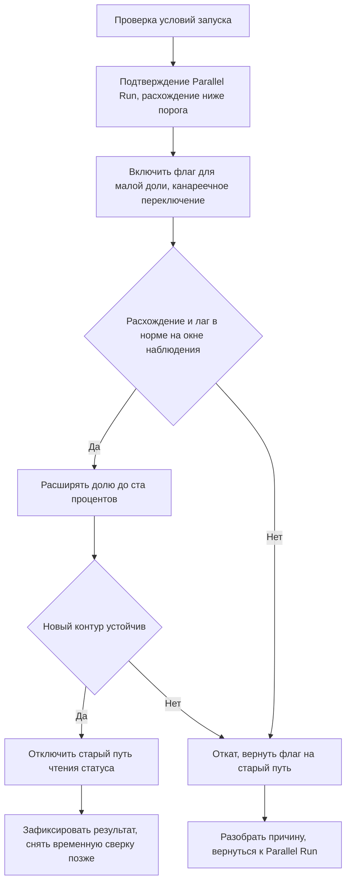

# Cutover-plan — переключение чтения статуса заказа на read-модель

Задание 4, артефакт cutover-plan.md. Документ описывает один ключевой переход из дорожной карты, а именно переключение потребителей статуса заказа на новый сервис статусов и таймлайна, который является read-моделью на каноническом слое событий. Этот переход выбран, поскольку он даёт высокую бизнес-ценность через единый источник правды по статусу, но остаётся вне транзакции оформления и потому управляем по риску. Переход относится к этапу Wave 3 из файла migration-roadmap.md и к точке трансформации TP-3 из файла ../Task3/transformation.md.

План учитывает не только техническое переключение, но и состояние данных, наблюдаемость и проверку поведения нового контура относительно старого.

## 1. Цель переключения

Цель в том, чтобы внутренние потребители статуса, а именно карточка заказа в поддержке и клиентские витрины статуса, начали читать статус и историю заказа из нового сервиса статусов вместо разрозненных источников в монолите и Oracle. Ожидаемый эффект в том, что статус перестаёт расходиться между личным кабинетом, письмом, оператором и складом, что двигает требования NFR-08, NFR-10 и NFR-12 и снижает нагрузку на поддержку.

## 2. Область и границы

В область входит только путь чтения статуса и истории заказа. Запись статуса остаётся в монолите и не меняется, поскольку это часть ядра, которое на данном этапе только изолируется. Переключение выполняется по подходу Parallel Run, то есть новый сервис уже работает и наполняется из событий, а сверка идёт до переключения. Переключение потребителей делается через флаг функциональности, поэтому его можно быстро отменить.

## 3. Условия запуска

- [ ] Слой событий из Wave 2 стабилен, а поток событий покрывает создание заказа, смену статуса и ключевые доставочные события.
- [ ] Сквозная наблюдаемость из Wave 1 включена, поэтому по любому заказу собирается сквозной таймлайн, что требует NFR-11.
- [ ] Сервис статусов работает в режиме Parallel Run на репрезентативном окне, а расхождение с текущим источником ниже согласованного порога.
- [ ] Согласована допустимая задержка обновления статуса в read-модели, что закрывает пробел GAP-04 у S4 и S6.
- [ ] Определён и протестирован флаг функциональности для переключения и мгновенного отката.
- [ ] Согласовано окно переключения с минимальной нагрузкой, а команды поддержки и эксплуатации предупреждены.
- [ ] Готов дашборд сверки нового и старого контура и алерты на превышение порога расхождения.

Пороговые значения расхождения и допустимой задержки являются пробелом и уточняются у S4 и S6 до начала перехода, поскольку конкретных цифр во входных данных нет.

## 4. Роли и ответственность

| Роль | Ответственность в переходе |
|------|----------------------------|
| Владелец перехода, релиз-менеджер | Принимает решение о старте, переключении и откате, ведёт таймлайн |
| Команда сервиса статусов | Отвечает за read-модель, сверку и флаг функциональности |
| Команда монолита S3 | Отвечает за источник событий и за неизменность пути записи |
| Поддержка S4 | Валидирует карточку заказа на реальных кейсах и подтверждает объяснимость статуса |
| Аналитика S6 | Подтверждает согласованность статуса в витринах |
| Эксплуатация S7 | Мониторит инфраструктуру, брокер и лаг событий |

## 5. Пошаговый сценарий переключения

Шаг 1 состоит в финальной проверке условий запуска из раздела 3 и в фиксации решения о старте. Шаг 2 состоит в подтверждении, что режим Parallel Run на окне перед переходом даёт расхождение ниже порога, а лаг событий в норме. Шаг 3 состоит во включении флага функциональности для малой доли потребителей, например для части операторов поддержки, что является канареечным переключением. Шаг 4 состоит в наблюдении за сверкой, лагом и обращениями в течение согласованного окна и в подтверждении, что расхождение и задержка в норме. Шаг 5 состоит в поэтапном расширении доли переключённых потребителей до ста процентов с продолжением наблюдения. Шаг 6 состоит в отключении старого пути чтения статуса только после устойчивой работы нового контура. Шаг 7 состоит в фиксации результата и в снятии временных сверочных механизмов после согласованного периода стабильности.

Диаграмма последовательности перехода приведена ниже в Mermaid, а её исходник в PlantUML лежит в файле diagrams/cutover-sequence.puml.

## 6. Состояние данных

Read-модель наполняется из канонического слоя событий, поэтому перед переходом выполняется первичное наполнение историей, а именно проекция накопленных событий заказа в модель. Согласованность является итоговой, то есть модель догоняет источник в пределах согласованной задержки, что связано с пробелом GAP-04. Перед переключением проверяется, что для репрезентативной выборки заказов статус и история в read-модели совпадают с текущим источником в пределах порога. Поскольку путь записи не меняется, риск потери данных отсутствует, а расхождение при откате устраняется возвратом чтения на старый источник.

## 7. Наблюдаемость перехода

Во время перехода отслеживаются несколько сигналов. Отслеживается лаг событий, то есть задержка между изменением в источнике и обновлением read-модели. Отслеживается расхождение, то есть доля заказов, где статус в новом и старом контуре различается. Отслеживается доля переключённых потребителей через флаг. Отслеживаются обращения в поддержку по непонятному статусу, поскольку рост таких обращений является ранним признаком проблемы. Все сигналы выводятся на общий дашборд, а на превышение порогов настроены алерты. Сквозной correlation-id из Wave 1 позволяет по конкретному спорному заказу сравнить оба контура.

## 8. Проверки после переключения

- [ ] Расхождение статуса между новым и старым контуром остаётся ниже согласованного порога на боевом трафике.
- [ ] Лаг событий не превышает согласованную допустимую задержку.
- [ ] Поддержка подтверждает, что карточка заказа даёт единый и объяснимый статус на реальных кейсах, включая отклонения от happy path.
- [ ] Аналитика подтверждает согласованность статуса в витринах.
- [ ] Число обращений по непонятному статусу не выросло относительно baseline из Wave 0.
- [ ] Старый путь чтения статуса отключён и не используется потребителями.

## 9. Сценарий отката

Откат выполняется мгновенно через возврат флага функциональности на старый путь чтения статуса, поскольку путь записи не менялся и старый источник всё это время оставался консистентным. Откат инициируется при превышении порога расхождения, при недопустимом лаге событий, при росте обращений в поддержку по статусу или по решению владельца перехода. После отката потребители снова читают статус из прежнего источника, а команда сервиса статусов разбирает причину расхождения и возвращается в режим Parallel Run до следующей попытки. Поскольку откат не затрагивает данные записи, он безопасен и не требует восстановления состояния.

Критерий необратимости достигается только на шаге отключения старого пути чтения, поэтому этот шаг выполняется в последнюю очередь и лишь после устойчивой работы нового контура. До этого момента переход полностью обратим.

## 10. Критерии завершения перехода

Переход считается завершённым, когда все потребители читают статус из нового сервиса, старый путь чтения отключён, расхождение и лаг удерживаются в согласованных пределах на боевом трафике, а поддержка и аналитика подтвердили единый и объяснимый статус. После согласованного периода стабильности снимаются временные сверочные механизмы, а результат фиксируется как достигнутое состояние этапа Wave 3.
