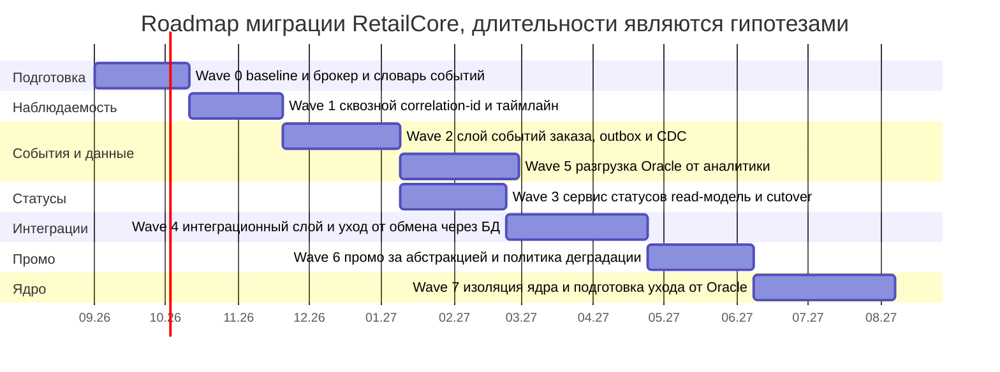
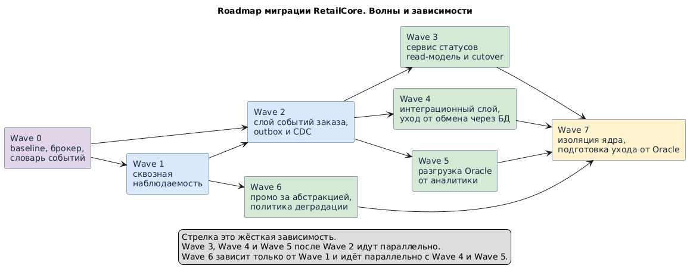

# Roadmap миграции — RetailCore

Задание 4, артефакт migration-roadmap.md. Документ описывает реалистичный план перехода от текущего состояния к целевому промежуточному состоянию без остановки критичных процессов. Для каждого этапа указаны цель и промежуточное состояние, зависимости, риски и критерии завершения. План опирается на точки трансформации из файла ../Task3/transformation.md и на подтверждённые ограничения из заданий 1 и 2.

Горизонты этапов заданы относительно, поскольку конкретные сроки и ёмкость команд во входных данных отсутствуют, что фиксирует пробел GAP-10. Порядок этапов важнее календарных дат, а длительности являются гипотезами и уточняются у S1 и S8.

## 1. Логика последовательности

Последовательность построена так, чтобы риск нарастал постепенно, а ценность появлялась на каждом этапе. Сначала идут enabling-шаги, а именно baseline и наблюдаемость, поскольку без них нельзя измерять эффект и безопасно переключаться. Затем строится канонический слой событий, поскольку от него зависят статусы, аналитика и интеграции. Затем выносятся периферийные и слабосвязанные участки, а именно read-модель статусов, интеграционный слой и разгрузка Oracle от аналитики. Промо выносится позже, поскольку влияет на сумму заказа. Ядро оформления и оплаты изолируется в конце горизонта и не переписывается, поскольку это зона высокого риска с незакрытыми пробелами по консистентности.

## 2. Обзорная диаграмма этапов

Ниже приведены два взаимодополняющих вида. Mermaid-gantt показывает волны на временной шкале, при этом длительности являются гипотезами. Компактная схема волн из PlantUML показывает жёсткие зависимости и параллельность между волнами и лежит в файле diagrams/migration-roadmap.puml, из которого генерируется картинка diagrams/migration-roadmap.png.

Компактная схема волн и зависимостей из PlantUML приведена ниже.

## 3. Этапы

### Wave 0. Подготовка, baseline и фундамент

Цель этапа в том, чтобы закрыть блокирующие пробелы и создать измеримую точку отсчёта. Промежуточное состояние состоит в том, что проведены интервью с S2, S7 и S8, зафиксированы baseline-метрики, а именно время от идеи до прода, доля ручных операций, MTTR и p95 checkout, поднят брокер сообщений и согласован единый словарь бизнес-событий заказа и доставки. Зависимости состоят в доступности стейкхолдеров и инфраструктуры. Риски состоят в том, что без baseline эффект этапов нельзя доказать бизнесу, что критично по требованию CON-02. Критерии завершения состоят в том, что baseline зафиксирован, брокер готов и словарь событий утверждён, а пробелы GAP-02, GAP-06 и GAP-07 переведены из статуса неизвестно в согласованные значения либо в явные предположения.

### Wave 1. Сквозная наблюдаемость, TP-1

Цель этапа в том, чтобы получить сквозной correlation-id и таймлайн заказа. Промежуточное состояние состоит в том, что идентификатор прокидывается через монолит, .NET и Python, а логи структурированы. Зависимости состоят в результатах Wave 0. Риски низкие и сводятся к неполному покрытию старых веток, поэтому покрытие расширяется итеративно. Критерии завершения состоят в том, что по заказу можно собрать сквозную цепочку событий на happy path и на ключевых отклонениях, что двигает требования NFR-09 и NFR-11. Ценность этапа в том, что поддержка быстрее разбирает кейсы ещё до глубоких изменений.

### Wave 2. Канонический слой событий заказа, TP-2

Цель этапа в том, чтобы публиковать канонические бизнес-события заказа согласованно с изменениями в БД. Промежуточное состояние состоит в том, что работает Transactional Outbox и CDC, а события идут в брокер. Зависимости состоят в брокере и словаре из Wave 0 и в наблюдаемости из Wave 1. Риски состоят в неполноте событийной модели и в двойной записи, что снимается паттерном Transactional Outbox и сверкой. Критерии завершения состоят в том, что поток событий покрывает создание заказа, смену статуса и ключевые доставочные события, что двигает требование NFR-07, а допустимая задержка события согласована, что закрывает пробел GAP-04. Ценность этапа в том, что появляется единая основа для статусов, аналитики и интеграций.

### Wave 3. Сервис статусов и таймлайна как read-модель, TP-3

Цель этапа в том, чтобы дать единый источник правды по статусу. Промежуточное состояние состоит в том, что сервис строит read-модель из событий, работает в режиме Parallel Run рядом со старым путём, а затем потребители переключаются на него. Зависимости состоят в слое событий из Wave 2. Риски состоят в расхождении read-модели с источником, что снимается сверкой и порогом расхождения перед переключением. Критерии завершения состоят в том, что расхождение ниже согласованного порога на репрезентативном окне, потребители переключены, а старый путь чтения статуса отключён, что двигает требования NFR-08, NFR-10 и NFR-12. Само переключение подробно описано в файле cutover-plan.md. Ценность этапа в том, что поддержка и клиент получают единый и объяснимый статус.

### Wave 4. Интеграционный слой и уход от обмена через БД, TP-4

Цель этапа в том, чтобы унифицировать интеграции и убрать обмен через staging-таблицы. Промежуточное состояние состоит в том, что появляется фасад с Anti-Corruption Layer на партнёра, единый контракт статуса доставки и ключи идемпотентности, а обмен через staging сворачивается по подходу Expand and Contract, начиная с одного партнёра. Зависимости состоят в слое событий из Wave 2. Риски состоят в дублях при повторной обработке и в скрытых потребителях staging-таблиц, поэтому сначала выявляются все читатели таблиц, а сжатие идёт после миграции потребителей. Критерии завершения состоят в том, что для первого партнёра обмен через БД отключён, дубли не воспроизводятся, что двигает требование NFR-05, а семантика доставки согласована, что закрывает пробел GAP-07. Ценность этапа в снижении ручного разбора и дублей заявок.

### Wave 5. Разгрузка операционной Oracle от аналитики, TP-5

Цель этапа в том, чтобы снять тяжёлую аналитическую нагрузку с операционной БД. Промежуточное состояние состоит в том, что аналитическое хранилище питается из слоя событий, а витрины ведутся параллельно старым до подтверждения эквивалентности. Зависимости состоят в слое событий из Wave 2. Этап может идти параллельно с Wave 3 и Wave 4, поскольку слабо связан с ними. Риски состоят в разрыве lineage и в расхождении витрин на переходе, что снимается параллельным ведением и сверкой. Критерии завершения состоят в том, что тяжёлые выгрузки перенесены с операционной Oracle, а расхождение витрин ниже порога, что двигает требования NFR-18 и NFR-22. Ценность этапа в снижении влияния аналитики на checkout на пиках.

### Wave 6. Промо за абстракцией и явная политика деградации, TP-6

Цель этапа в том, чтобы сделать промо предсказуемым и управляемым. Промежуточное состояние состоит в том, что промо живёт за абстракцией по паттерну Branch by Abstraction, старая и новая реализации сверяются, а деградация оформлена как явная политика с наблюдаемостью. Зависимости состоят в наблюдаемости из Wave 1 и в согласованных правилах деградации. Риски состоят в изменении суммы заказа, поэтому переключение идёт постепенно и со сверкой сумм. Критерии завершения состоят в том, что новая реализация покрывает согласованные сценарии, скрытый fallback на legacy_promo_pkg отключён или сделан явным, что двигает требования NFR-02 и NFR-14, а правила деградации согласованы, что закрывает пробел GAP-05. Ценность этапа в предсказуемости промо для бизнеса.

### Wave 7. Изоляция ядра и подготовка ухода от Oracle, TP-7

Цель этапа в том, чтобы обвести ядро оформления и оплаты чёткими границами и подготовить постепенный уход от Oracle. Промежуточное состояние состоит в том, что вокруг ядра стоит Anti-Corruption Layer, данные текут через события, а обмен через БД свёрнут для основных потребителей. Оркестрация оплаты остаётся в монолите. Зависимости состоят во всех предыдущих этапах. Риски состоят в регрессиях checkout и оплаты, поэтому здесь выполняется только изоляция, а не перенос логики. Критерии завершения состоят в том, что ядро изолировано швами, а план импортозамещения получил конкретные даты и границы, что закрывает пробел GAP-08 и двигает требования NFR-13 и NFR-19. Ценность этапа в том, что появляется опора для следующих шагов за пределами текущего горизонта.

## 4. Зависимости между этапами

| Этап | Зависит от | Может идти параллельно с |
|------|-----------|--------------------------|
| Wave 0 | Нет | Нет |
| Wave 1 | Wave 0 | Нет |
| Wave 2 | Wave 0 и Wave 1 | Нет |
| Wave 3 | Wave 2 | Wave 5 |
| Wave 4 | Wave 2 | Wave 5 |
| Wave 5 | Wave 2 | Wave 3 и Wave 4 |
| Wave 6 | Wave 1 | Wave 4 и Wave 5 |
| Wave 7 | Все предыдущие | Нет |

## 5. Сводный реестр рисков программы

| Риск | Этап | Смягчение |
|------|------|-----------|
| Отсутствие baseline не даёт доказать эффект бизнесу | Wave 0 | Зафиксировать метрики до старта изменений |
| Незакрытые пробелы по консистентности блокируют ядро | Wave 0 и Wave 7 | Интервью с S8, явные предположения до фиксации GAP-06 |
| Двойная запись событий и рассинхрон | Wave 2 | Transactional Outbox и сверка |
| Расхождение read-модели статусов с источником | Wave 3 | Parallel Run и порог расхождения перед cutover |
| Скрытые потребители staging-таблиц | Wave 4 | Инвентаризация читателей до сжатия по Expand and Contract |
| Дубли заявок у партнёров | Wave 4 | Ключи идемпотентности и инбокс |
| Изменение суммы заказа при выносе промо | Wave 6 | Постепенное переключение и сверка сумм |
| Потеря наблюдаемости на переходе | Все этапы | Наблюдаемость из Wave 1 как предусловие каждого cutover, что требует NFR-11 |
| Регрессии checkout и оплаты | Wave 7 | Только изоляция ядра, без переноса логики |

## 6. Критерии успеха программы

Критерии успеха сформулированы на языке бизнеса из интервью S1 и требуют baseline из Wave 0 для измерения. Базовый процесс заказа стал стабильнее и предсказуемее. Типовые коммерческие изменения запускаются быстрее и с меньшим числом скрытых зависимостей. По заказам и статусам появилась единая и доверенная картина данных. Снизилась доля ручных и героических процессов между командами. Появилась понятная платформа для следующих шагов, а именно новые сервисы, партнёры и каналы. Конкретные целевые значения этих метрик являются пробелом и уточняются у S1, что относится к GAP-11.

Детальный сценарий одного ключевого переключения описан в файле cutover-plan.md.
